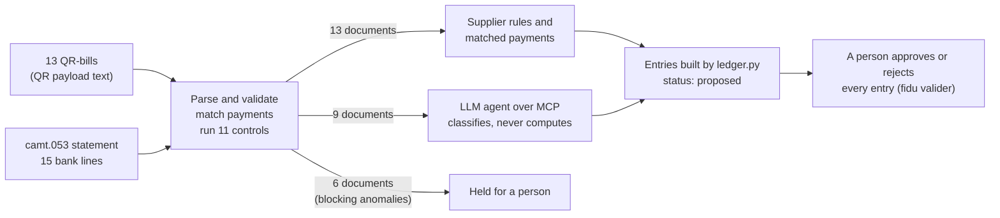

# fiduciaire-agent

Swiss pre-accounting where code does every calculation, an LLM agent only classifies what no rule
covers, and a person approves every entry. In three logged runs the agent classified 9 out of 9
documents correctly, and it never touched any of the documents held back by the controls.

[](https://github.com/Pchambet/fiduciaire-agent/actions/workflows/ci.yml)

[](LICENSE)

**English** · [Français](README.fr.md)



## TL;DR

- **28 documents in, three ways out.** The demo month has 13 QR-bills and a camt.053 statement
  with 15 lines. Code proposes 13 entries (5 from supplier rules, 8 from matched payments). 9
  documents go to the agent. 6 documents are held for a person by the 6 blocking anomalies; the
  7th planted anomaly, an overdue invoice, is flagged but still booked. A test locks this split.
- **The agent never produces a number.** It sends an account, a VAT code when the bill gives none,
  and a one-sentence reason. The ledger module builds the lines. An unbalanced entry cannot be
  stored.
- **No tool can approve.** The MCP server exposes six tools, and none of them approves or rejects
  an entry. A test drives the server through a real MCP client and asserts this.
- **Eleven controls, checked exactly.** A test requires the controls to find the seven planted
  anomalies and nothing else. The other four controls are tested separately.
- **Real formats, verified checksums.** The code reads the Swiss QR-bill payload (SIX, version 0200),
  Swico S1 VAT blocks and ISO 20022 camt.053 (.04 and .08). QRR, ISO 11649 and IBAN check digits are
  tested against the samples SIX and ISO publish. The suite has 86 tests, ruff runs in CI, and the
  only runtime dependency is the MCP SDK.

## Result: the agent evaluation

The demo month contains nine documents that no rule covers. Each one has a known answer (account
and VAT code) in `demo.EXPECTED_CLASSIFICATION`. `fidu evaluer` scores the agent's proposals
against that answer key. The agent had only the six MCP tools. It had no file access, so it could
not read the answer key.

| Model | Correct classifications | Tool calls | Server refusals | Turns | Duration | Cost |
|---|---|---|---|---|---|---|
| Claude Opus 5.5 | **9 / 9** | 15 | 0 | 16 | 42 s | $0.19 |
| Claude Sonnet 5 | **9 / 9** | 13 | 0 | 14 | 41 s | $0.14 |
| Claude Sonnet 5, after review fixes | **9 / 9** | 13 | 0 | 14 | 47 s | $0.09 |

Runs from 2026-09-28, each on a freshly loaded demo month (`fidu demo`). The third run used the
code after the fixes listed in [What review changed](#what-review-changed). The
correct-classification count comes from `fidu evaluer`. The other columns were read from the CLI's
stream-json output and copied by hand; the raw transcripts were not kept, so they cannot be
re-checked. The exact command, the model's verbatim summary and what the runs changed in the code
are in [`docs/essais.md`](docs/essais.md) (in French). **Nine documents and one or two runs per model are
not a benchmark.** These runs show that the pipeline works end to end. They do not give a model's
error rate on real documents.

## Why it matters

A fiduciary's monthly work for a client is mostly mechanical: read invoices, match payments, split
VAT. A small part needs judgement, such as which account a new supplier belongs to. Giving all of
it to a language model would turn every number into a probabilistic one. Keeping everything in
hand-written rules leaves every new supplier waiting for someone to write a rule. This project
draws the line explicitly. The model's error is limited to one small, named and measurable decision
(the classification). Responsibility for each entry stays with a person.

## Approach

The diagram at the top shows the triage. Who does what:

| Who | Does what |
|---|---|
| **Code** | Reads and validates QR-bills (QRR and ISO 11649 check digits, IBAN, QR-IBAN/reference consistency, Swico S1 VAT block), reads camt.053, matches payments (by reference, then by account and exact amount when only one candidate exists), runs eleven controls, **builds every entry** |
| **Agent** | Classifies the documents no rule covers: an account, a VAT code if the bill gives none, and a reason. It computes no amount |
| **A person** | Approves or rejects each entry. `fidu valider <n> --retenir` turns an approved classification into a supplier rule, so next month that supplier skips the model |

### The eleven controls

| Control | Severity | Planted in the demo |
|---|---|---|
| QR-bill rejected at parsing (here: reference check digit) | high | 1 |
| Bill VAT inconsistent with its amount | high | 1 |
| Bill received twice | high | 1 |
| Bill paid twice | high | 1 |
| Payment amount differs from the bill | high | 1 |
| Payment reference matches no bill | medium | 1 |
| Bill overdue and unpaid at the statement date | medium | 1 |
| QR-bill without an amount | medium | tested separately |
| Incomplete statement: balances do not reconcile | high | tested separately |
| Payment of a bill that is itself held | medium | tested separately |
| Payment without reference matching several bills | medium | tested separately |

A document with a blocking anomaly gets no automatic entry and is never offered to the agent. The
one exception is the overdue bill, which is still a debt to book.

### Design decisions

Four short architecture decision records (in French) in [`docs/adr/`](docs/adr):

| ADR | Decision | Option rejected |
|---|---|---|
| [0001](docs/adr/0001-deterministe-d-abord.md) | Deterministic code first; the agent only gets what no rule covers | Give the model everything, or write rules for everything |
| [0002](docs/adr/0002-l-agent-classe-le-grand-livre-ecrit.md) | The agent classifies; the ledger writes the lines | Let the agent write lines and validate them afterwards |
| [0003](docs/adr/0003-un-humain-valide-chaque-ecriture.md) | A person approves every entry, and the agent has no tool to do it | Auto-approve above a confidence threshold (self-reported confidence is not calibrated) |
| [0004](docs/adr/0004-mcp-plutot-qu-un-appel-direct.md) | Expose the tools over MCP | Call the model API from the application (the better choice for a fully integrated loop) |

## Run it

Requires [uv](https://docs.astral.sh/uv/). Runs in seconds and needs no network after `uv sync`.
The command line and the server messages are in French, because the target user is a
French-speaking fiduciary in Geneva.

```bash
uv sync
uv run fidu demo                        # write the demo month and load it
uv run fidu anomalies                   # the 7 planted anomalies
uv run fidu proposees                   # 13 entries proposed by rules and payment matching
uv run fidu valider --origine rapprochement
uv run fidu a-classer                   # the 9 documents for the agent
uv run fidu classer F-hotel-7730 6640 --justification "Nuitées d'un séminaire client"
uv run fidu valider 14 --retenir        # an approved classification becomes a supplier rule
uv run fidu evaluer                     # score the classifications against the answer key
uv run pytest -q
```

Output of `fidu anomalies` on the demo month:

```
haute    amount_mismatch    B-BK-0922-01                     Télécom Démo SA : facture 162.15 CHF, payé 150.00 CHF
haute    duplicate_invoice  F-papeterie-2026-0917-copie      Papeterie Démo SA : même facture que F-papeterie-2026-0917, gardée comme originale
haute    duplicate_payment  B-BK-0909-01                     Informatique Démo SA : déjà payée par B-BK-0908-01
haute    qr_invalid         F-imprimerie-6612                imprimerie-6612.txt : référence QR invalide (chiffre de contrôle) : 000000000000000000011066125
haute    vat_inconsistent   F-nettoyage-0925                 Nettoyage Démo Sàrl : TVA incohérente : 1000 à 8.1 % donne 1081.00, la facture dit 1100.00
moyenne  unknown_reference  B-BK-0924-01                     Fournisseur Démo Inconnu : référence 000000000000000000019999997
moyenne  unpaid_overdue     F-informatique-4388              Informatique Démo SA 540.50 : échue le 2026-09-09
```

### Connect an MCP client

Claude Desktop (`claude_desktop_config.json`):

```json
{
  "mcpServers": {
    "fiduciaire": {
      "command": "uv",
      "args": ["run", "--project", "/path/to/fiduciaire-agent", "fidu-mcp"],
      "env": { "FIDU_BASE": "/path/to/livres.db" }
    }
  }
}
```

The six tools are `situation`, `pieces_a_classer`, `plan_comptable`, `anomalies` and
`expliquer_piece` (all read-only), plus `proposer_ecriture`. When the server refuses a proposal
(for example, the account is not an expense account, the VAT code contradicts the bill, or the
document is held), the refusal comes back to the model as a readable tool error, and the model uses
it to correct itself. The headless command used for the evaluation runs is in
[`docs/essais.md`](docs/essais.md).

## What is real and what is simulated

| | |
|---|---|
| Formats | **Real**: Swiss QR-bill payload (SIX, version 0200), Swico S1 block, ISO 20022 camt.053 (.04 and .08). Check digits are verified against SIX and ISO samples |
| VAT | Swiss rates in force since 1 January 2024: 8.1 %, 2.6 %, 3.8 % |
| Chart of accounts | A **subset** inspired by the Swiss SME chart of accounts, in one dictionary (`ledger.ACCOUNTS`). A real engagement would use the client's own chart |
| Data | **Fictitious**: one month (September 2026) for an invented client, 13 QR-bills and a 15-line statement. Every name contains « Démo », and the IBANs are computed, not collected |
| Agent | Three real runs with two models, logged above |

The code reads the **text** payload of the QR code, not the image. Decoding the image is a solved
problem for any barcode library. The work that matters to a fiduciary starts after that step.

## What review changed

- The **first agent run** found a real defect: an undated bill was dated at the statement date
  (30.09) although it had been paid on 20.09. An undated bill now takes the date of its matched
  payment, and a test covers this.
- A **separate correctness-only review pass** found nine defects. Each one was reproduced, fixed
  and covered by a test in `tests/test_edge_cases.py`. The most serious: the same QR reference at
  two suppliers created a false "paid twice" (a QR reference is unique only for one creditor
  account); a second identical payment without reference went unnoticed and doubled both the
  expense and the input VAT; a rejection was undone at the next load.

## Limitations

- One client and one accounting currency (CHF). A document in EUR is refused with a reason and has
  to be handled by hand.
- Sales are not tracked. A customer payment is classified, but it is not matched to a sales
  invoice. The agent flagged this itself: it booked two receipts to accounts receivable without
  being able to check that the sales invoices exist.
- Without a receipt date, the duplicate kept as the original is the first one in name order.
- camt.053: only booked entries (BOOK) are read. Reversals and fees deducted from a batch booking
  are not handled yet.
- The MCP server uses stdio: one workstation, one user, no authentication (see ADR 0004).
- No export to accounting software. The approved journal can be read (`fidu journal`) but is not
  exported yet.
- A bill that does not state its VAT is not yet flagged as an input-tax risk. The agent raised this
  in its first run.
- The evaluation covers nine synthetic documents. It shows that the pipeline works; it says nothing
  about accuracy on real documents.

## Repository layout

```
src/fiduciaire_agent/
  qrbill.py      QR-bill parsing and validation, Swico S1 block
  camt.py        camt.053 statements, batch bookings split per transaction
  ledger.py      chart of accounts, VAT codes, entry construction and invariants
  books.py       ingestion, matching, controls, proposals, approval, evaluation (SQLite)
  mcp_server.py  the agent's six tools
  cli.py         the accountant's command line (fidu)
  demo.py        the demo month, its planted anomalies and its answer key
tests/           86 tests, including the MCP server driven over stdio
docs/adr/        four architecture decision records
docs/essais.md   the logged agent runs
```

## References

- SIX, [Swiss QR-bill implementation guidelines](https://www.six-group.com/en/products-services/banking-services/payment-standardization/standards/qr-bill.html) (payload version 0200).
- Swico, billing information syntax S1 (the structured invoice data in the QR-bill); [QR-bill overview](https://www.swiss-qr-invoice.org/).
- SIX, [Swiss Payment Standards for ISO 20022](https://www.six-group.com/en/products-services/banking-services/payment-standardization/standards/iso-20022.html) (camt.053).
- ISO 11649:2009, structured creditor reference (RF).
- Swiss Federal Tax Administration, [VAT rates](https://www.estv.admin.ch/estv/en/home/value-added-tax/vat-rates-switzerland.html).
- [Model Context Protocol](https://modelcontextprotocol.io/).

## License

MIT, see [`LICENSE`](LICENSE).

---

Built by [Pierre Chambet](https://github.com/Pchambet) — decision science for operations under uncertainty.
